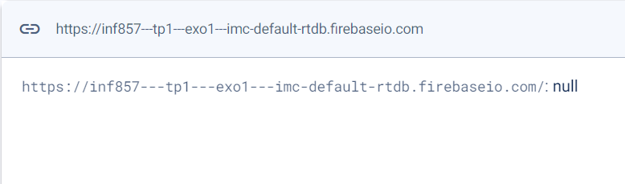
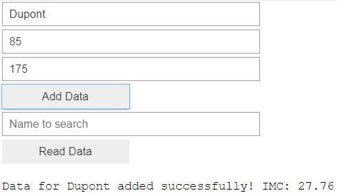
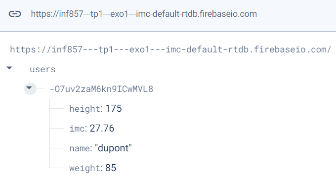
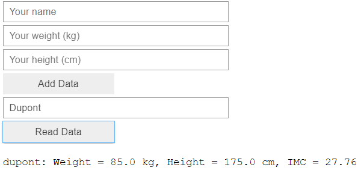

# imc-firebase-calculator
Projet universitaire de découverte des produits Firebase avec une application de calcul d'IMC.

## Présentation
L'application, développée en Python, est présentée sous la forme d'un Jupyter Notebook. Il suffit d'exécuter la première cellule pour générer une interface graphique permettant d'interagir avec une base de données en temps réel sur Firebase.  

L'application permet de saisir le nom, le poids et la taille d'une personne, puis calcule son indice de masse corporelle (IMC). Ces informations sont ensuite stockées dans le cloud via la base de données. L'application offre également la possibilité de rechercher des profils dans la base de données en utilisant le nom de la personne afin de récupérer ses informations.

## Comment lancer l'application
Afin de lancer l'application, il est d'abord nécessaire d'installer les librairies présentes dans le fichier *requirements.txt*.

Pour se connecter à la base de données, vous devez également disposer du fichier *credentials.json*, fourni avec le rendu du projet. Si vous n'avez pas ce fichier, vous devrez vous connecter à votre propre base de données Firebase. Pour cela, générez votre propre *credentials.json* que vous ajouterez au projet et ajustez l'URL de votre base de données à la ligne suivante du fichier *imc.ipynb* :

```python
firebase_admin.initialize_app(cred, {
    'databaseURL': 'https://your_url.firebaseio.com/'
})
```

Une fois l'application lancée, il ne reste plus qu'à entrer ses informations pour obtenir son IMC et envoyer les données à la base de données, ou bien rechercher un nom pour retrouver l'IMC de la personne dans la base de données.

## Fonctionnement
### Connexion à Firebase

L'application se connecte à Firebase pour stocker et récupérer les données des utilisateurs. Lors du démarrage, elle vérifie si l'application Firebase est déjà initialisée. Si ce n'est pas le cas, elle utilise le fichier *credentials.json* pour s'authentifier et accéder à la base de données en temps réel. Voici comment la connexion est établie :

```python
# Check if Firebase app is already initialized
if not firebase_admin._apps:
    # Initialize the Firebase app with the certificate and the URL of the Realtime Database
    cred = credentials.Certificate("credentials.json")
    firebase_admin.initialize_app(cred, {
        'databaseURL': 'https://inf857---tp1---exo1---imc-default-rtdb.firebaseio.com/'
    })
```

- **`cred = credentials.Certificate("credentials.json")`** : Cette ligne crée une instance de l'objet `credentials` à partir du fichier *credentials.json*. Ce fichier contient les informations d'authentification nécessaires pour accéder aux services Firebase de manière sécurisée. Cela permet à l'application de s'identifier et d'obtenir les autorisations requises pour interagir avec la base de données.

- **`firebase_admin.initialize_app(cred, { ... })`** : Cette commande initialise l'application Firebase avec les informations d'identification fournies par `cred` et configure l'URL de la base de données en temps réel. L'URL permet à l'application de savoir où se trouve la base de données à laquelle elle doit se connecter pour lire ou écrire des données. 


Voici la section mise à jour sur le calcul de l'IMC et l'écriture dans la base de données, avec une explication plus détaillée sur la méthode `push` et comment les données se retrouvent sous `users` :

### Calcul de l'IMC et écriture dans la BDD

Pour calculer l'IMC, l'application prend les valeurs de poids et de taille saisies par l'utilisateur. Elle effectue les vérifications nécessaires pour s'assurer que ces valeurs sont valides (nombre positif) et calcule l'IMC selon la formule suivante : 

$$
\text{IMC} = \frac{\text{Poids}}{\left(\frac{\text{Taille}}{100}\right)^2}
$$

Une fois le calcul effectué, les accents et les majuscules du nom sont standardisés pour faciliter la recherche ultérieure. Les informations (nom standardisé, poids, taille et IMC) sont ensuite enregistrées dans la base de données Firebase sous la référence `users`. Voici comment ces données sont enregistrées :

```python
def write_data(name, weight, height):
    ...
    ref = db.reference('users')
    imc = round(weight / (height / 100) ** 2, 2)  # Calculate IMC
    # write data
    ref.push({
        'name': unidecode(name).lower(),  # standardize string
        'weight': weight,
        'height': height,
        'imc': imc
    })
```

- **`ref = db.reference('users')`** : Cette ligne crée une référence à la collection `users` dans la base de données Firebase. C'est ici que toutes les données des utilisateurs seront stockées. Si cette référence n'existe pas encore dans la base de donnée alors elle sera créée par la méthode suivante :

- **`ref.push({...})`** : La méthode `push()` est utilisée pour ajouter une nouvelle entrée sous la référence portée par `ref`. Elle génère automatiquement une clé unique pour chaque nouvel enregistrement, garantissant que chaque utilisateur a une entrée distincte. Les données (nom, poids, taille et IMC) sont ensuite stockées sous cette clé unique. Cela signifie que chaque fois que `push()` est appelé, une nouvelle entrée est ajoutée à la collection (ici `users`), ce qui permet de garder une trace des informations de tous les utilisateurs.

Ainsi, les informations de chaque utilisateur sont organisées sous la référence `users` dans la base de données, permettant des lectures et des écritures faciles.

### Recherche par nom (Lecture dans la BDD)

L'application permet également de rechercher des utilisateurs par leur nom. Lorsqu'un utilisateur entre un nom et clique sur le bouton de recherche, l'application récupère les données de la base de données et cherche une correspondance. Voici comment la recherche est effectuée :

```python
def read_data(search_name):
    ...
    search_name = unidecode(search_name).lower()  # Standardize string
    ref = db.reference('users')
    data = ref.get()

    # Search in the data
    find = False
    if data:
        for _, value in data.items():
            if value['name'] == search_name:
                # We may find more than one match, in this case we print all of them
                print(...)
                find = True
    if not find:
        print("No data found for this name.")
```

- **`ref = db.reference('users')`** : De la même manière que dans la partie précédente, cette ligne crée une référence à la collection `users` dans la base de données Firebase, là où toutes les données des utilisateurs sont stockées.

- **`data = ref.get()`** : La méthode `get()` récupère toutes les données sous la référence `users`. Cela retourne un dictionnaire contenant toutes les entrées de la base de données, où chaque entrée est identifiée par une clé unique générée lors de l'écriture des données avec `push()`. 

- **Recherche dans les données** : Une fois que les données sont récupérées, l'application parcourt chaque entrée pour vérifier si le nom saisi par l'utilisateur correspond à un des noms stockés dans la base de données. Si une correspondance est trouvée, les informations de l'utilisateur sont affichées. Il est possible de tomber sur plusieurs instances avec le même nom, dans ce cas elles sont toutes affichées.

## Démonstration
Au départ, la base de données est vide, et nous avons l'interface Firebase suivante affichant `null` :  
  

Nous allons ensuite enregistrer une entrée à l'aide de l'application :  
  

Nous constatons maintenant que les informations saisies précédemment apparaissent dans la section `users` de l'interface Firebase, ainsi que la clé unique générée par la méthode `push()` :  
  

Enfin, nous pouvons récupérer les informations précédemment enregistrées directement depuis l'application de la manière suivante :  
  
